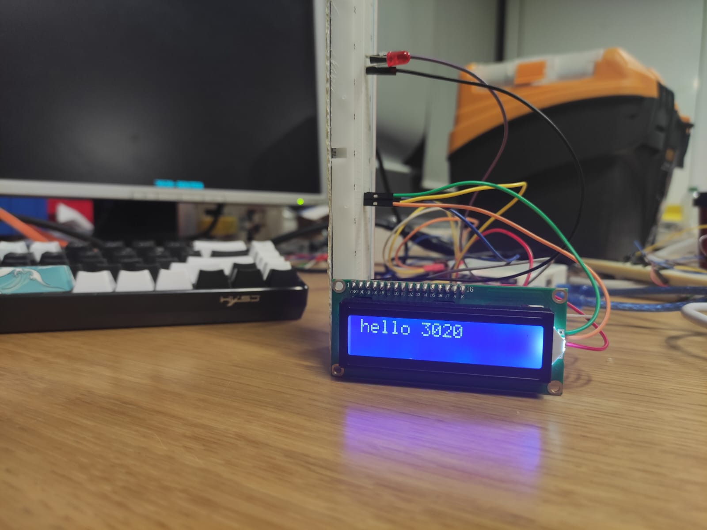
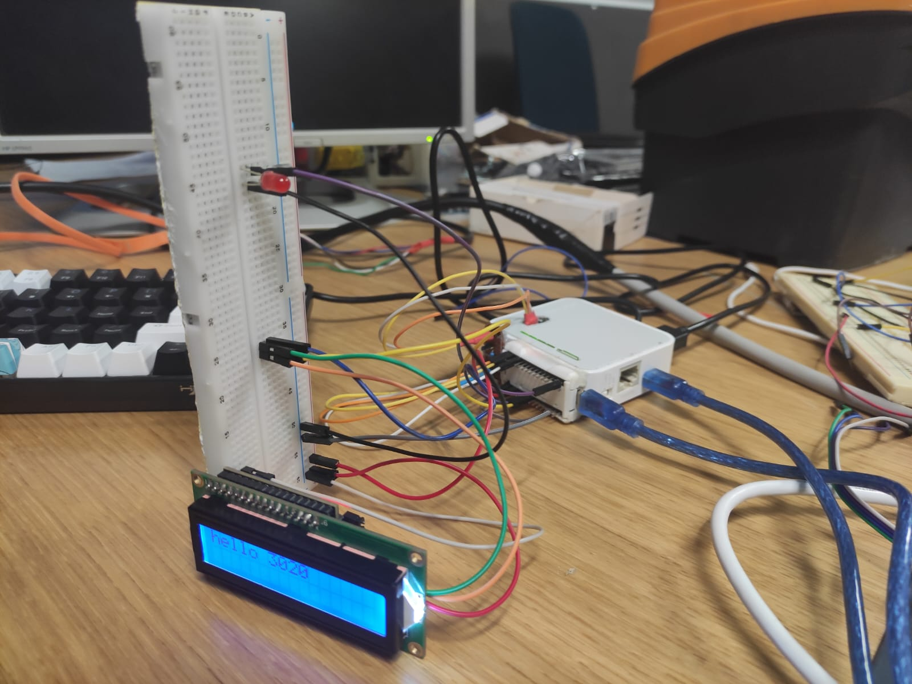

# 🔌 3020-NANO

A lightweight **Arduino Nano** firmware that listens for **serial commands** from the TL-MR3020 (as part of the *WhyNot* hardware hacking series).  
It allows remote execution of I/O operations such as reading/writing digital or analog pins, controlling an LCD, and soon — servos and more!

---

## 📸 Preview

<table>
  <tr>
    <td align="center"><br><b>LCD TEST</b></td>
    <td align="center"><br><b>SETUP with TL-MR3020</b></td>
  </tr>
</table>

## ✨ Features

- 🔌 **Serial command protocol** for controlling the Arduino Nano  
- 🧠 **Digital & analog I/O support** (`read`, `write`, `aread`, `awrite`, `pinmode`)  
- 💬 **LCD support (I²C)** with initialization, clearing, writing, and cursor control  
- 💡 **Error handling and human-readable responses** (`OK`, `KO`, with messages)  
- ⚙️ **Simple text-based protocol** — perfect for integration with routers or scripts  
- 🔧 **Easily extensible** — more modules (servo, sensors, etc.) coming soon  

---

## 📡 Protocol Overview

Commands are sent as **newline-terminated strings (`\n`)** over serial (9600 baud).  
Each command is space-separated and can include parameters.

### Supported Commands

| Command | Description |
|----------|-------------|
| `exec` | Execute higher-level operations (e.g., LCD control) |
| `read <pin>` | Read digital value from a pin |
| `write <pin> <low/high>` | Write digital value |
| `aread <apin>` | Read analog value |
| `awrite <apin> <value>` | Write analog value |
| `pinmode <pin> <input/output>` | Configure a pin mode |

---

## 💬 LCD Commands (`exec lcd <command>`)

| LCD Command | Parameters | Description |
|--------------|-------------|-------------|
| `init <addr> <width> <height>` | I²C address + dimensions | Initialize LCD screen |
| `write <text>` | Text to display | Write text to LCD |
| `clear` | — | Clear screen |
| `cset <x> <y>` | Cursor coordinates | Set cursor position |

Example:
```
exec lcd init 0x27 16 2
exec lcd write Hello, World!
exec lcd cset 0 1
exec lcd write 3020 Ready
```

---

## 💬 Example Usage

Using any serial terminal (e.g., `minicom`, `screen`, or via your TL-MR3020):

```
pinmode 13 output
write 13 high
read 13
```

Response:
```
OK [pinmode set]
OK
OK [Value = 1]
```

---

## 🧱 Hardware Setup

- **Board:** Arduino Nano  
- **LCD:** I²C LCD (address configurable via commands)  
- **Connection:** Serial link with TL-MR3020 running custom firmware from the *WhyNot* series, or any serial-capable host.  
- **Baud rate:** `9600`

---

## ⚙️ Building & Uploading

Using **PlatformIO** or the **Arduino IDE**:

```bash
# PlatformIO
pio run
pio run -t upload

# Or Arduino IDE
Select board: Arduino Nano
Select port: /dev/ttyUSB0
Upload
```

---

## 🧩 Recent Additions

- 🧱 Added `3020.h` header and LCD module structure  
- 🧠 Added new LCD commands (`init`, `write`, `clear`, `cset`)  
- ✅ Added error messages for missing/invalid parameters  
- 🔄 Dynamic LCD initialization with address and size detection  
- 🧩 Future modules in development: **Servo control**, **PWM**, **Sensors**

---

## 🔭 Future Plans

- ⚙️ Add **servo motor** and **PWM** support  
- 🧠 Introduce **error codes** for better debugging  
- 🧩 Extend LCD commands (custom chars, scrolling, etc.)  
- 🖥️ Add **OLED display** support
---

## 🤝 Contributing

Pull requests and suggestions are welcome!  
Please open issues for bugs or feature requests.

---

## 🧩 License

MIT License — free to use, modify, and share.

---

> 🧠 *Part of the 3020 Project – Hacking Hardware, Not People.*  
> **Repair. Repurpose. Reinvent.**
